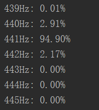
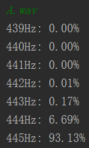
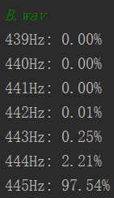
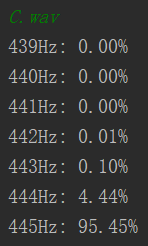
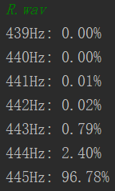

# 信号与系统大作业

## 无72 饶淙元 2017011285

#### 1. 一个乐音必须持续多长时间才能测出3Hz的频差？

　　具体推导过程书上已经给出，这里不必再推导一遍，直接套用结论，而考虑到现实中的信号理应是因果信号，且3Hz的频差是指比440Hz高，属于单边情况，因此$\Delta t\Delta f\ge\frac1{4\pi}$，从而得到$\Delta t\ge0.08s$。

　　即一个乐音必须持续0.08s才能测出3Hz的频差。

#### 2. 前述小提琴奏鸣曲对应的A4是440Hz吗？

　　为了得出结论，我采用分类器的思路解决这一问题，以下是解决思路与结论。

##### 2.1 提出问题

　　我们已经知道在一段乐曲中最初几秒钟是小提琴独奏，现在将它截取出来，并且我们具备关于音高的一些基本知识，试用相关技术手段判断这段小提琴奏鸣曲的A4是不是440Hz。

##### 2.2 预备知识

　　我不具备太多的乐理知识，目前掌握了以下信息：

1. 一般来说A4应该是440Hz，并且其他音高应该是它的$2^{n/12}$倍。
2. 对于小提琴我们希望其声音频率是标准、唯一的，但实际上可能出现拉不准、谐音干扰等因素，而钢琴等乐器频率相对准确，但是谐音更为复杂。
3. 从有乐理知识的同学那里得知(见致谢)一般小提琴的音阶主要在G3到C7，也即$A4\times2^{-14/12}$~$A4\times2^{27/12}$。
4. 传闻爱乐乐团标准音高443Hz，实际上查询网上资料知某些乐团会提到445Hz，但一般不会超出这个范围。

##### 2.3 解决思路

　　虽然本问的问题只是让判断是否是440Hz，但下一问直接问A4的值，因此不妨把两问做成一问，在这里直接求标准音高。基于前文的先验，我计划按下面思路进行计算：

1. 以1Hz精度(分辨率)对音频进行快速傅里叶变换，对得到的不同频点的值取对数作为强度；
2. 假设标准音高可能是339、440、441、442、443、444、445这七个频点，考虑这七个不同标准音高对应的G3~C7音阶的频率，出于精度进行四舍五入到就近整数值(低频段会有重叠，不影响结论)；
3. 用分类器的思想，将不同频点对应的全部音阶频点的强度分别相加，得到各个分类结果的总强度，再用softmax函数进行归一化，得到各个标准音高的确信度(概率)。

　　在这个简单的设计方案中，有一些部分其实是没有绝对把握的：

1. 第一步中取对数这一点的依据主要是声音强度一般以分贝(dB)为单位，本就是考虑的对数值，我不确定这样处理的可靠性，这是源于我对声音信号领域基础知识的匮乏，此处不妨假定这是可靠的。
2. 第二步中选取这7个频点主要是基于一般对乐团标准音高的先验，此处我认为这个范围已经涵盖了可能的标准音高。
3. 第三步中的softmax函数常用于机器学习里分类结果的归一化，但是机器学习有一个学习过程对前面的权重值进行优化，而此处我没有任何训练集来判断这样做是否可靠，仅仅凭直觉认为这样可行。

　　作业要求中提到“只要理论和方法恰当，都是很好的”，这里我不敢肯定是否“恰当”，但不妨就照着这个思路往下做。

#### 2.4 代码编写

　　由于我个人对python使用比较熟练，因此代码由python写成，用到scipy与numpy两个科学计算的库。

**2.4.1 数据准备**

　　首先import相关库，并读取数据文件，此处我假设已经有一个变量`file`作为音频文件名称。

```python
from scipy.io import wavfile
import numpy as np
from scipy.signal import windows
from scipy.fftpack import fft
import os

# read wav first
frame_per_second, data = wavfile.read(file)
if len(data.shape) == 2:
    data = data[:, 0]
```

　　这里导入的`scipy.io.wavfile`是一个处理wav文件的类；`numpy`是常用的python科学计算库，主要提供多维数组运算；`scipy.signal.windows`中涵盖了常见的窗函数，下面会用到hamming窗；`scipy.fftpack.fft`是快速进行傅里叶变换的函数。

　　读取文件时得到了音频文件的两个信息：帧率(frame_per_second)，每帧的声音强度所形成的数组。

**2.4.2 参数准备**

　　经过简单的学习得知，快速傅里叶变换(FFT)是取时域上一段数据进行加窗后做变换得到基频整数倍的频点强据，因此需要考虑清楚每次用多少个数据点进行分析(抽样长度 slice_length)，以及隔多远取一组数据(抽样间隔 interval)。

　　由数学分析可知，用帧率除以分辨率可以得到抽样长度，这也正是FFT需要的参数之一(样点个数 n_fft)，也即我放入1s长的数据进行FFT后得到的结果是以1Hz的各个倍数，具体来说会有0~frame_per_second倍，但由于FFT的计算结果是对称的，因此只取前一半的数据作为结果。

　　对于抽样间隔，主要是希望一个持续时间比较短的音尽量能出现在同一次抽样里，这里不妨取抽样间隔为抽样长度的1/4，即0.25s，这样一来长度不超过0.75s的音都将被完整包含，我认为对实际演奏而言这应该足够了。经过简单的计算可以得到在这样的情况下抽样帧数为frame_number = (data_length- slice_length) // interval + 1，其中data_length为音频数据中总帧数。

　　做FFT时的窗函数选择hamming窗，这是FFT常用的窗函数，这里不妨选择它。

```python
# then set some basic factors
frequency_resolution = 1
slice_length = frame_per_second // frequency_resolution
n_fft = slice_length
interval = slice_length // 2
frame_number = (len(data) - slice_length) // interval + 1
fft_amplitude = np.zeros([n_fft // 2 + 1, frame_number])
hamming = windows.hamming(slice_length)
```

**2.4.3 FFT**

　　用一个循环计算每一次抽样的结果，为此将每次抽样的数据和窗函数相乘后再做FFT，得到的结果除以抽样长度进行归一化。

　　FFT结果是复数，但本问题中不关心相位，因此取其幅度(fft_amplitude)；又由于FFT结果的对称性，只取前一半幅度，将它们乘以2以合并后一半，需要注意此时频率为0的直流分量本不应该乘以2，但是后面的问题并不会用到直流分量，因此忽略这个问题。

　　最后将得到的不同样本段的各个频点幅度取对数得到我们所用的强度。需要注意，如果出现了原始强度为0的点会导致负无穷的下溢，因此我对算出来的幅度加了一个1e-16的偏置，从后文可以知道这对最终结果不会有什么影响。

　　有了这些分析后，得到代码如下：

```python
# process fft for each frame
for frame in range(frame_number):
    frame_start = interval * frame
    data_slice = data[frame_start:frame_start + slice_length]
    data_windowed = data_slice * hamming
    fft_result = fft(data_windowed, slice_length) / slice_length
    # fft result's amplitude is symmetric, so we just get half data of result
    # by the way, plus 1e-16 to avoid -inf warning in log function
    fft_amplitude[:, frame] = 2 * abs(fft_result[:n_fft // 2 + 1]) + 1e-16
# use log to suppress the amplitude
fft_amplitude_log = np.log(fft_amplitude)
```

**2.4.4 分类准备**

　　此处分类目标为439~445这七个频点，计算每一个频点的全部音阶频点在FFT结果中的位置，由于这里的分辨率为1，因此位置基本就是频点本身的数值，只是需要四舍五入找最近的整数点，使用二维数组mat来记录这些整数，它的第一个维度对应不同的标准音高，第二个维度对应不同的音阶。

　　另外准备一个score数组，它将会把各个标准音高对应音阶的频点强度值加起来作为评分。

```python
# expect a4 tune to be 339 to 445, which is prior
a4 = np.arange(439, 446)
# a4 to g3: 2^(-14/12), a4 to c7: 2^(27/12)
coefficient = np.power(2, np.arange(-14, 28) / 12)
# here we use around to get closest frequency point
mat = np.around(np.outer(a4, coefficient) / frequency_resolution).astype(int)
# notice that score[0] for 339Hz, score[-1] is score[6] for 445Hz
score = np.zeros(len(a4))
```

**2.4.5 分类计算**

　　进行强度求和时我除以帧数进行归一化，这主要是考虑到假设一个频点强度比另一个频点强度略大那么一丁点，那么在持续时间足够长后分类器会让它们有天壤之别，这是不合理的，因此求一个均值，以保证数据的稳定性。

　　此外在求和时我只对正数进行求和，这是考虑到对强度的求和本就不应该出现“越加越小”的情况，因此做了一个简单的处理作为下界约定。但这个约定也只是一种主观约束，实际上或许有更合理的下界选取，但由于缺乏相关数据我无法寻找这个合适的下界。

　　在用softmax之前先减去所有评分值的最大值，以防求指数时出现上溢，然后将softmax归一化处理得到的结果直接作为评估概率并进行输出。

```python
# set lower limit for amplitude, here just omit negative number
min_amp = 0
# now sum up for each frequency
for i in range(len(score)):
    aim = fft_amplitude_log[mat[i]]
    # here divide frame_number to normalize the score
    score[i] = aim[aim > min_amp].sum() / frame_number
# avoid overflow in softmax
score -= score.max()
# use softmax to evaluate probability
probability = np.exp(score) / np.exp(score).sum()

# then output the result
for i in range(len(probability)):
    print("{}Hz: {:.2f}%".format(a4[i], probability[i] * 100))
```

##### 2.5 运行结果

　　为了方便起见，我除了上述代码之外加了一点处理文件路径以及主循环的代码，集合成了code文件夹内的main.py，并且只需要在程序里输入文件名即可进行分析，程序将自动检索当前目录以及当前目录下的data文件夹内的内容，建议将音频文件放入data文件夹内后进行分析。

　　运行编写好的程序，输入`test.wav`，得到以下输出：



　　可以看到441Hz的概率已经有94.90%之高，并且概率分布呈现近似的正态分布，可以说是一个比较科学的结果。当然，回归问题本身，本问只是问是不是440Hz，因此我的结论是：有97.09%的把握，目标音频中小提琴A4不是440Hz。

#### 3. 前述世界著名乐团的标准音高到底是多少？

　　我到网上找了几个维也纳爱乐乐团的录音作为样例，对其中小提琴比较多的部分进行截取、测试（各个文件说明见文档），对于我找的样例A.wav,B.wav,C.wav,R.wav，结果分别如下：

  

  

　　可见，对于我选取的几个样例，我都有较大把握其标准音高为445Hz。

　　但我认为这边并不表示爱乐乐团的标准音高就是443Hz，因为维也纳爱乐乐团成立于1842年(摘自维基百科)，已经存在近两百年，这期间国际上对于A4的标准都已经更改了若干次，乐团的负责人也不知换了多少任，同时还要考虑到不同时代校准音高的技术可能不同(比如说我就很不解两百年前人们是怎么测评出440Hz与443Hz的差别的)，如果说A4音高在随时代、随指挥爱好而改变，这也毫不奇怪。

　　因此我只能说从我找到的样例来看，其标准音高很可能是445Hz，但对于问题中求维也纳爱乐乐团的标准音高，我认为这个问题本身可能不是很完备(或者我可以就不同年代、不同指挥做一个穷举式的表格，但那可能就成了一篇音乐史论文了)。

#### 4. 后记

##### 4.1 感想

　　在这个大作业中，我在既不会FFT也没有乐理知识的情况下勉强给出了一个思路和结论。在完成大作业期间，看到信号与系统微信群里的讨论，经常让我感到汗颜，比如说我就绝对不会想到去找一个乐曲对应的谱子，因为我觉得要看懂谱子难度已经比完成大作业要大了。

　　但是，在完成作业过程中我对声信号的数字存储有了更多的了解，现在我知道了wav就如同图片中的bmp一样，是一种无压缩的数字信号原始记录，因而相同的音频进行格式转化时wav往往是“体积”最大的一个。而解析mp3的库就不那么容易找了，因而我断定mp3一定是经过某种有损压缩过程的，而我查询相关资料得到的结果也和我的猜测相符。

　　在wav文件中主要是对每一帧的信号强度进行逐帧记录，因此会有相关的库很容易地把它读成时域波形的样子，这也正印证了数字信号领域的记录方法：过一个固定的间隔进行一次抽样，记录下当前的幅度。只要抽样频率足够高，得到的结果就可以看作是连续的——至少人耳很难区分一个信号是否经过了这样一系列的处理。

　　我用分类器的思想完成了任务，但分类器的设计会带来若干问题，比如分类依据是否可靠？我将不同频率的强度进行相加，但这些强度本身是取对数来的，后面又做了softmax，这就相当于把本来FFT得到的频率幅度相乘后线性地求比值，只不过在这个过程中我舍去了幅度小于1的以防“越乘越小”罢了。另一个问题是我设计的类是否足够？如果标准音高比439Hz低或者比445Hz高怎么办？这是我的设计中没有解决的问题，因为我的先验知识告诉我不会出现这样的情况，但实际上我又没有一些数据集来进行拟合，所以我很难评判自己方法的可靠性，最多只能说做到了自洽。

　　最后，信号与系统课程也收尾了，这里我情不自禁要附上那句经典台词：信号与系统很有趣！

##### 4.2 致谢

1. 感谢无72的乔玥涵告诉我小提琴的音阶范围；
2. 感谢无76的孙志尧帮我从我找的若干个音频文件中挑出小提琴部分；
3. 感谢谷老师提供的MATLAB脚本，我的python代码的FFT部分基本是完成了一个翻译。